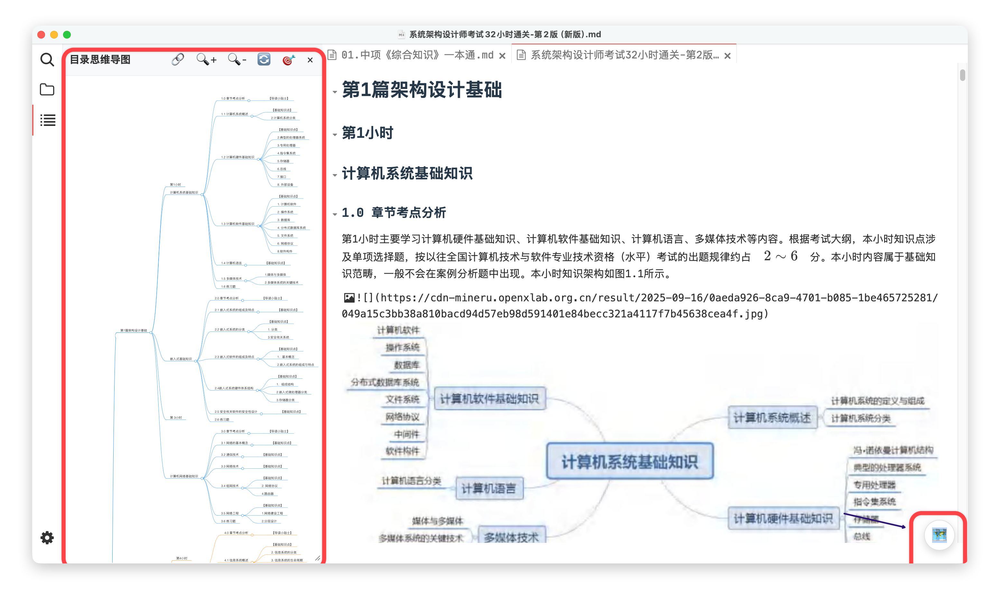

# Typora Markmap Plus 插件

[](https://github.com/util6/typora-plugin-markmap-plus/blob/main/LICENSE.md)

一份功能增强的 Typora 插件，用于创建交互式思维导图（Markmap），尤其专注于提供一个强大的“目录思维导图”功能。

## ✨ 主要功能

- **目录思维导图 (TOC Mindmap)**：
  - 快速为当前文档的所有标题（H1-H6）生成一个交互式思维导图。
  - 以一个可自由拖动、缩放的**悬浮窗口**形式展示。
  - 支持将窗口**嵌入 Typora 的侧边栏**，与文档融为一体。
  - 点击思维导图中的节点，可**平滑滚动**到文档中的对应标题位置。
  - 支持放大、缩小、刷新和“适应视图”等常用操作。
- **悬浮按钮**：在 Typora 窗口右下角提供一个快捷按钮 🗺️，用于快速显示/隐藏目录思维导图。
- **高度可配置**：通过插件的设置面板，可以自定义多项行为。

## 🚀 安装与使用

### 安装

1. 从本项目的 [GitHub Releases](https://github.com/util6/typora-plugin-markmap-plus/releases) 页面下载最新的 `markmap.zip` 文件。
2. 解压后得到 `markmap` 文件夹。
3. 打开 Typora，进入 `偏好设置` -> `插件`，点击 `打开插件文件夹`。
4. 将解压得到的 `markmap` 文件夹完整地放入 Typora 的插件文件夹中。
5. 重启 Typora。

### 使用

- **打开/关闭目录思维导图**：

  - 点击 Typora 窗口右下角的 🗺️ 悬浮按钮。
  - (未来版本可能会支持快捷键 `Cmd+M`)
- **与思维导图交互**：

  - **移动窗口**：拖动窗口顶部的标题栏。
  - **缩放窗口**：拖动窗口的右下角。
  - **嵌入/取消嵌入侧边栏**：点击窗口标题栏的 📌 按钮。
  - **缩放/平移导图**：在思维导图区域内滚动鼠标滚轮或拖动。
  - **跳转到标题**：点击思维导图中的任意一个节点。




## ⚙️ 配置选项

你可以在 `偏好设置` -> `插件` -> `Markmap` 中找到本插件的配置项：

- **窗口宽度**：目录思维导图悬浮窗口的默认宽度（单位：像素）。
- **窗口高度**：目录思维导图悬浮窗口的默认高度（单位：像素）。
- **默认展开层级**：首次生成思维导图时，默认展开到第几级标题。
- **缩放步长**：每次点击放大/缩小按钮时，视图的缩放比例。

## 👨‍💻 开发

如果你想为此项目贡献代码或进行二次开发，请遵循以下步骤：

1. **克隆仓库**

   ```bash
   git clone https://github.com/util6/typora-plugin-markmap-plus.git
   cd typora-plugin-markmap-plus
   ```
2. **安装依赖**

   ```bash
   npm install
   ```
3. **开发模式**
   运行以下命令，它会自动编译代码，并将产物安装到 Typora 的插件目录中。修改代码后，需要重启 Typora 以查看效果。

   ```bash
   npm run dev
   ```
4. **生产构建**
   运行以下命令以生成用于发布的优化后的代码。

   ```bash
   npm run build
   ```

## 📄 许可证

本项目基于 [MIT](https://github.com/util6/typora-plugin-markmap-plus/blob/main/LICENSE.md) 许可证开源。
