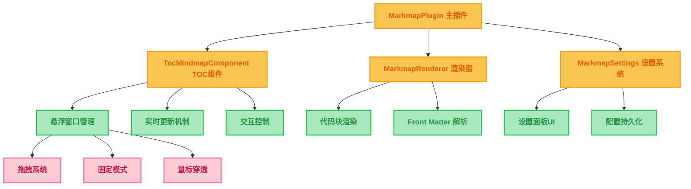

# Typora Markmap Plus Plugin

一个功能强大的 Typora 插件，让你能够在 Typora 中创建和查看交互式思维导图。基于原版 markmap 插件深度重构，提供更丰富的功能和更好的用户体验。

## ✨ 核心特性

### 🎯 双模式思维导图

| 模式 | 功能 | 描述 |
|------|------|------|
| **代码块 Markmap** | ✅ 完整实现 | 在 `markmap` 代码块中直接渲染思维导图 |
| **TOC Markmap** | ✅ 完整实现 | 将文档目录结构转换为交互式思维导图 |

### 🎛️ 智能悬浮窗口

| 功能 | 状态 | 描述 |
|------|------|------|
| **拖拽移动** | ✅ 完整实现 | 可自由拖拽窗口到任意位置 |
| **大小调整** | ✅ 完整实现 | 支持双向调整窗口尺寸 |
| **多种固定模式** | ✅ 完整实现 | 右侧固定、顶部固定、全屏展开 |
| **鼠标穿透** | ✅ 完整实现 | 允许鼠标操作穿透窗口到编辑器 |
| **实时更新** | ✅ 完整实现 | 文档变化时自动更新思维导图 |

### ⚙️ 完整设置系统

| 设置分类 | 功能 | 描述 |
|---------|------|------|
| **基础设置** | ✅ 完整实现 | 默认高度、背景色、节点间距配置 |
| **TOC 配置** | ✅ 完整实现 | 悬浮按钮、自动更新、窗口尺寸、展开层级 |
| **主题设置** | ✅ 完整实现 | 预设配色方案、自定义颜色管理 |
| **交互设置** | ✅ 完整实现 | 缩放、拖拽、自动适应视图 |
| **高级设置** | ✅ 完整实现 | 调试模式、一键重置功能 |

### 🚀 便捷操作

| 功能 | 快捷键/方式 | 描述 |
|------|-------------|------|
| **快速切换** | `Ctrl+M` | 快速打开/关闭 TOC Markmap |
| **悬浮按钮** | 右下角按钮 | 一键访问 TOC 功能 |
| **模板插入** | 命令面板 | 快速插入预设的 markmap 代码块 |
| **工具栏操作** | 窗口工具栏 | 固定、刷新、适应、穿透等功能 |

## 🏗️ 技术架构

### 组件化设计



### 技术栈

- **核心框架**: `@typora-community-plugin/core` v2.5.28
- **思维导图引擎**: `markmap-lib` v0.18.12, `markmap-view` v0.18.12
- **数学公式**: `katex` v0.16.19
- **配置解析**: `js-yaml` v4.1.0
- **构建工具**: `rollup`, `esbuild`, `typescript`
- **开发语言**: TypeScript

## 📦 安装方法

### 方式一：GitHub Releases（推荐）

1. 访问 [Releases 页面](https://github.com/util6/typora-plugin-markmap-plus/releases)
2. 下载最新版本的 `typora-plugin-markmap-plus-vX.X.X.zip`
3. 解压到 Typora 插件目录
4. 重启 Typora

### 方式二：开发模式安装

```bash
git clone https://github.com/util6/typora-plugin-markmap-plus.git
cd typora-plugin-markmap-plus
npm install
npm run dev
```

## 🎮 使用指南

### 代码块 Markmap

在 Typora 中创建 `markmap` 代码块：

````markdown
```markmap
---
height: 400px
backgroundColor: "#f8f8f8"
---

# 项目管理

## 计划阶段
- 需求分析
  - 用户调研
  - 竞品分析
- 技术选型
  - 前端框架
  - 后端架构

## 开发阶段
- 前端开发
  - UI 设计
  - 交互实现
- 后端开发
  - API 设计
  - 数据库设计

## 测试阶段
- 单元测试
- 集成测试
- 用户验收测试
```
````

### TOC Markmap

#### 打开方式
- **快捷键**: `Ctrl+M`
- **悬浮按钮**: 点击右下角的悬浮按钮
- **命令面板**: 搜索 "Toggle TOC Markmap"

#### 窗口操作

| 操作 | 方法 | 说明 |
|------|------|------|
| **移动窗口** | 拖拽标题栏 | 可移动到屏幕任意位置 |
| **调整大小** | 拖拽窗口边缘 | 支持水平和垂直调整 |
| **右侧固定** | 点击 📌 按钮 | 固定到编辑器右侧 |
| **顶部固定** | 点击 ⬆️ 按钮 | 固定到编辑器顶部 |
| **全屏展开** | 点击 ⛶ 按钮 | 全屏显示思维导图 |
| **刷新内容** | 点击 ⟳ 按钮 | 手动刷新思维导图 |
| **适应视图** | 点击 🎯 按钮 | 自动调整到最佳视图 |
| **鼠标穿透** | 点击 👻 按钮 | 允许鼠标操作穿透到编辑器 |

### 设置配置

通过 `偏好设置` → `插件` → `MarkmapPlus` 打开设置面板：

#### 基础设置
- **默认高度**: 代码块思维导图的默认高度 (200-800px)
- **默认背景色**: 思维导图的背景颜色
- **水平间距**: 节点之间的水平距离 (20-200px)
- **垂直间距**: 节点之间的垂直距离 (10-100px)

#### TOC 配置
- **显示悬浮按钮**: 控制右下角悬浮按钮的显示
- **自动更新**: 文档变化时自动更新 TOC 思维导图
- **初始展开层级**: TOC 思维导图的默认展开深度 (1-6)
- **窗口宽度**: TOC 窗口的默认宽度 (300-800px)
- **窗口高度**: TOC 窗口的默认高度 (200-600px)

#### 主题设置
- **配色方案**: 选择预设配色（默认/深色/浅色/自定义）
- **自定义颜色**: 添加和管理自定义颜色方案

#### 交互设置
- **启用缩放**: 允许用户缩放思维导图
- **启用拖拽**: 允许用户拖拽思维导图节点
- **自动适应**: 自动调整思维导图大小以适应容器

#### 高级设置
- **调试模式**: 启用详细的调试日志输出
- **重置设置**: 一键恢复所有设置为默认值

### Front Matter 配置

在 markmap 代码块中使用 YAML Front Matter 进行个性化配置：

```yaml
---
height: 400px              # 设置高度
backgroundColor: "#f0f0f0"  # 设置背景色
colorFreezeLevel: 2         # 颜色冻结层级
maxWidth: 300              # 最大宽度
# 更多 markmap-lib 支持的选项...
---
```

## 🛠️ 开发信息

### 项目结构

```
typora-plugin-markmap-plus/
├── src/
│   ├── main.ts                    # 主插件文件
│   ├── settings.ts                # 设置系统
│   ├── utils.ts                   # 工具函数
│   ├── markmap-renderer.ts        # 代码块渲染器
│   ├── markmap-view.ts            # 视图管理
│   ├── components/
│   │   └── TocMindmap.ts          # TOC 组件
│   └── manifest.json              # 插件清单
├── dist/                          # 构建输出
├── .github/workflows/
│   └── release.yml                # 自动发布流水线
├── build.js                       # 开发构建脚本
├── rollup.config.js               # 生产构建配置
├── release.sh                     # 发布脚本
└── package.json                   # 项目配置
```

### 构建命令

| 命令 | 用途 |
|------|------|
| `npm run dev` | 开发模式构建并安装到 Typora |
| `npm run build` | 生产模式构建 |
| `npm run package` | 构建发布版本 |
| `npm run test` | 构建并提示测试 |
| `npm run clean` | 清理构建文件 |
| `./release.sh <version>` | 自动发布新版本 |

### 开发流程

1. **克隆项目**: `git clone https://github.com/util6/typora-plugin-markmap-plus.git`
2. **安装依赖**: `npm install`
3. **开发模式**: `npm run dev`
4. **测试功能**: 在 Typora 中测试插件功能
5. **构建发布**: `./release.sh 1.x.x`

## 🔧 故障排除

### 常见问题

#### 插件没有加载
- 检查 Typora 版本是否 >= 1.4.0
- 检查插件是否正确安装到插件目录
- 查看开发者工具控制台是否有错误信息
- 确认插件在 `偏好设置` → `插件` 中已启用

#### TOC Markmap 不显示
- 确保文档中有标题（h1-h6）
- 检查快捷键 `Ctrl+M` 是否冲突
- 尝试点击右下角悬浮按钮
- 检查设置中是否启用了悬浮按钮

#### 代码块不渲染
- 确保代码块语言设置为 `markmap`
- 检查 markmap 语法是否正确
- 查看控制台错误信息
- 尝试重新加载插件

#### 思维导图显示异常
- 检查 Front Matter 配置是否正确
- 尝试清除浏览器缓存
- 重启 Typora 应用
- 查看调试日志（开启调试模式）

### 调试模式

在设置面板中开启调试模式，插件会在控制台输出详细信息：

```javascript
// 打开开发者工具 (F12) 查看日志
console.log('[MarkmapPlus] 插件加载完成')
console.log('[MarkmapPlus] 显示 TOC Markmap')
console.log('[MarkmapPlus] 渲染代码块思维导图')
```

## 🤝 贡献指南

欢迎提交 Issue 和 Pull Request！

### 贡献流程
1. Fork 项目
2. 创建功能分支: `git checkout -b feature/amazing-feature`
3. 提交更改: `git commit -m 'Add amazing feature'`
4. 推送到分支: `git push origin feature/amazing-feature`
5. 创建 Pull Request

### 开发规范
- 使用 TypeScript 编写代码
- 遵循现有的代码风格
- 添加必要的注释和文档
- 确保功能完整测试

## 📄 许可证

MIT License - 详见 [LICENSE](LICENSE.md) 文件

## 🔄 更新日志

### v1.3.0 (2024-09-25)
- ✅ **完整集成设置面板功能**
  - 所有设置项现在都能真正影响插件行为
  - 基础设置：默认高度、背景色、间距等
  - TOC 配置：悬浮按钮、自动更新、窗口尺寸
  - 主题设置：配色方案、自定义颜色
  - 交互设置：缩放、拖拽、自动适应
  - 高级设置：调试模式、重置功能
- ✅ **设置实时生效**
  - 修改设置后立即应用到新的思维导图
  - 悬浮按钮显示/隐藏根据设置自动切换
  - 调试模式动态控制日志输出
- ✅ **模板自动更新**
  - 插入的代码块模板使用当前设置的默认值
- ✅ **完善的设置面板 UI**
  - 分类清晰的设置界面
  - 颜色选择器和滑块控件
  - 重置功能和确认对话框

### v1.2.0 (2024-06-28)
- ✅ 完整重构插件架构为组件化设计
- ✅ 实现所有核心功能模块
- ✅ 添加详细的调试日志系统
- ✅ 优化用户体验和交互流程
- ✅ 完善文档和测试用例

---

**享受在 Typora 中创建交互式思维导图的乐趣！** 🎉

如有问题或建议，请访问 [GitHub Issues](https://github.com/util6/typora-plugin-markmap-plus/issues)
