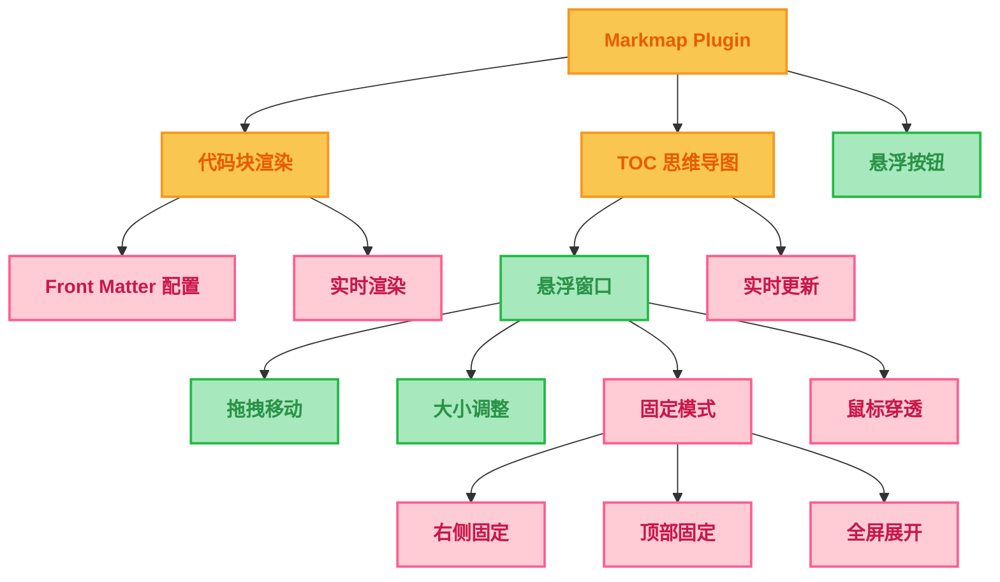

# Typora Markmap Plus Plugin

一个功能强大的 Typora 插件，让你能够在 Typora 中创建和查看交互式思维导图。

## 功能特性

### 🎯 核心功能

| 功能模块 | 状态 | 描述 |
|---------|------|------|
| **代码块 Markmap** | ✅ 完整实现 | 在代码块中渲染思维导图 |
| **TOC Markmap** | ✅ 完整实现 | 将文档目录结构转换为思维导图 |
| **悬浮窗口** | ✅ 完整实现 | 可拖拽、可调整大小的悬浮窗口 |
| **多种固定模式** | ✅ 完整实现 | 支持右侧固定、顶部固定、全屏展开 |
| **实时更新** | ✅ 完整实现 | 文档变化时自动更新思维导图 |
| **快捷键支持** | ✅ 完整实现 | `Ctrl+M` 快速切换 TOC Markmap |

### 🎛️ 设置面板

| 设置分类 | 功能 | 描述 |
|---------|------|------|
| **基础设置** | ✅ 完整实现 | 默认高度、背景色、间距配置 |
| **TOC 配置** | ✅ 完整实现 | 悬浮按钮、自动更新、窗口尺寸 |
| **主题设置** | ✅ 完整实现 | 预设配色方案、自定义颜色 |
| **交互设置** | ✅ 完整实现 | 缩放、拖拽、自动适应 |
| **高级设置** | ✅ 完整实现 | 调试模式、重置设置 |



## 安装方法

### 方式一：开发模式安装

1. 克隆项目到本地
2. 安装依赖：`npm install`
3. 构建并安装：`npm run dev`
4. 重启 Typora

### 方式二：手动安装

1. 下载最新的发布版本
2. 解压到 Typora 插件目录
3. 重启 Typora

## 使用指南

### 代码块 Markmap

在 Typora 中创建 `markmap` 代码块：

````markdown
```markmap
---
height: 300px
backgroundColor: "#f8f8f8"
---

# 项目管理

## 计划阶段
- 需求分析
  - 用户调研
  - 竞品分析
- 技术选型

## 开发阶段
- 前端开发
- 后端开发

## 测试阶段
- 单元测试
- 集成测试
```
````

### TOC Markmap

1. **打开方式**：
   - 使用快捷键 `Ctrl+M`
   - 点击右下角的悬浮按钮
   - 通过命令面板搜索 "Toggle TOC Markmap"

2. **窗口操作**：
   - **拖拽移动**：拖拽标题栏移动窗口
   - **调整大小**：拖拽窗口边缘调整大小
   - **工具栏功能**：

| 按钮 | 功能 | 描述 |
|------|------|------|
| ⬆️ | 顶部固定 | 固定到编辑器顶部 |
| 📌 | 右侧固定 | 固定到编辑器右侧 |
| ⛶ | 全屏展开 | 全屏显示思维导图 |
| ⟳ | 刷新 | 手动刷新思维导图 |
| 🎯 | 适应视图 | 自动调整视图大小 |
| 👻 | 鼠标穿透 | 允许鼠标操作穿透窗口 |
| × | 关闭 | 关闭 TOC Markmap |

### 设置面板

通过 `偏好设置` -> `插件` -> `Markmap` 打开设置面板，可以配置：

#### 基础设置
- **默认高度**: 代码块思维导图的默认高度
- **默认背景色**: 思维导图的背景颜色
- **水平间距**: 节点之间的水平距离 (20-200px)
- **垂直间距**: 节点之间的垂直距离 (10-100px)

#### TOC 配置
- **显示悬浮按钮**: 控制右下角悬浮按钮的显示
- **自动更新**: 文档变化时自动更新 TOC 思维导图
- **初始展开层级**: TOC 思维导图的默认展开深度 (1-6)
- **窗口尺寸**: TOC 窗口的默认宽度和高度

#### 主题设置
- **配色方案**: 选择预设的配色方案（默认/深色/浅色/自定义）
- **自定义颜色**: 添加和管理自定义颜色

#### 交互设置
- **启用缩放**: 允许用户缩放思维导图
- **启用拖拽**: 允许用户拖拽思维导图
- **自动适应**: 自动调整思维导图大小

#### 高级设置
- **调试模式**: 启用详细的调试日志
- **重置设置**: 恢复所有设置为默认值

### 插入模板

通过命令面板搜索 "Insert Markmap Template" 可以快速插入一个预设的 markmap 代码块模板。

## 配置选项

### Front Matter 配置

在 markmap 代码块中可以使用 YAML Front Matter 进行配置：

```yaml
---
height: 400px              # 设置高度
backgroundColor: "#f0f0f0"  # 设置背景色
# 更多 markmap-lib 支持的选项...
---
```

## 开发信息

### 技术栈

- **核心框架**: `@typora-community-plugin/core`
- **思维导图引擎**: `markmap-lib`, `markmap-view`
- **构建工具**: `esbuild`, `rollup`
- **语言**: TypeScript

### 项目结构

```
typora-plugin-markmap/
├── src/
│   ├── main.ts           # 主插件文件
│   └── manifest.json     # 插件清单
├── test/
│   └── vault/
│       └── doc.md        # 测试文档
├── dist/                 # 构建输出
├── build.js              # 开发构建脚本
├── rollup.config.js      # 生产构建配置
└── package.json          # 项目配置
```

### 构建命令

| 命令 | 用途 |
|------|------|
| `npm run dev` | 开发模式构建并安装 |
| `npm run build` | 生产模式构建 |
| `npm run package` | 打包发布版本 |
| `npm run test` | 构建并提示测试 |

## 故障排除

### 常见问题

1. **插件没有加载**
   - 检查 Typora 版本是否 >= 1.4.0
   - 检查插件是否正确安装到插件目录
   - 查看开发者工具控制台是否有错误信息

2. **TOC Markmap 不显示**
   - 确保文档中有标题（h1-h6）
   - 检查快捷键是否冲突
   - 尝试点击悬浮按钮

3. **代码块不渲染**
   - 确保代码块语言设置为 `markmap`
   - 检查 markmap 语法是否正确
   - 查看控制台错误信息

### 调试模式

开发模式下，插件会在控制台输出详细的调试信息：

```javascript
// 打开开发者工具查看日志
console.log('Markmap Plugin: 插件加载完成')
console.log('Markmap Plugin: 显示 TOC Markmap')
```

## 贡献指南

欢迎提交 Issue 和 Pull Request！

1. Fork 项目
2. 创建功能分支
3. 提交更改
4. 推送到分支
5. 创建 Pull Request

## 许可证

MIT License

## 更新日志

### v1.3.1 (2024-09-26)
- ✅ **简化侧边栏嵌入功能**
  - 将原来的三个方法（`toggleSidebarEmbed`、`embedInSidebar`、`restoreFloatingModal`）合并为一个简洁的切换方法
  - 移除了复杂的 `SidebarMarkmap` 类，直接在主类中实现侧边栏功能
  - 代码更简洁，维护更容易
  - 功能保持不变：支持悬浮窗口和侧边栏嵌入模式的切换

### v1.3.0 (2024-09-25)
- ✅ **完整集成设置面板功能**
  - 所有设置项现在都能真正影响插件行为
  - 基础设置：默认高度、背景色、间距等
  - TOC 配置：悬浮按钮、自动更新、窗口尺寸
  - 主题设置：配色方案、自定义颜色
  - 交互设置：缩放、拖拽、自动适应
  - 高级设置：调试模式、重置功能
- ✅ **设置实时生效**
  - 修改设置后立即应用到新的思维导图
  - 悬浮按钮显示/隐藏根据设置自动切换
  - 调试模式动态控制日志输出
- ✅ **模板自动更新**
  - 插入的代码块模板使用当前设置的默认值
- ✅ **完善的设置面板 UI**
  - 分类清晰的设置界面
  - 颜色选择器和滑块控件
  - 重置功能和确认对话框

### v1.2.0 (2024-06-28)
- ✅ 完整重构插件架构
- ✅ 实现所有核心功能
- ✅ 添加详细的调试日志
- ✅ 优化用户体验
- ✅ 完善文档和测试

### v1.1.3
- 基础功能实现

---

**享受在 Typora 中创建思维导图的乐趣！** 🎉
