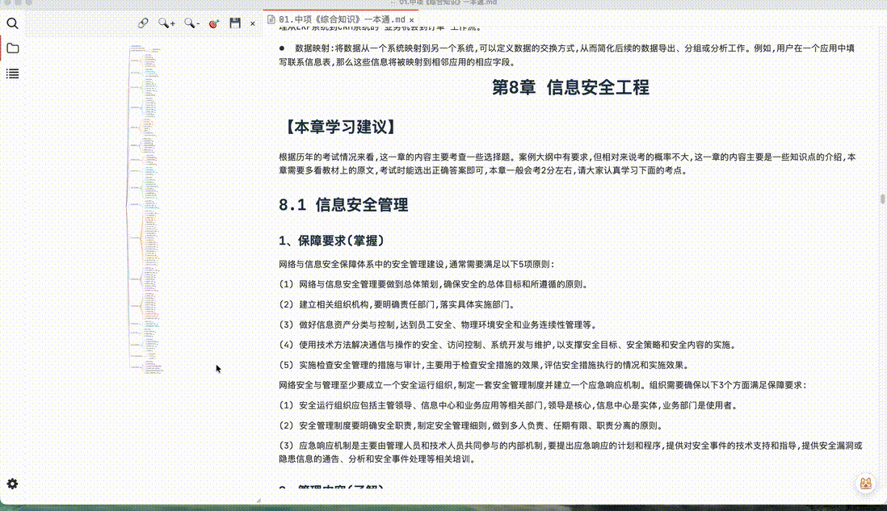

# Typora Markmap Plus 插件

[](https://github.com/util6/typora-plugin-markmap-plus/blob/main/LICENSE.md)

一个功能强大的 Typora 插件，为文档标题生成交互式思维导图，支持实时更新、双向跳转、自定义样式等高级特性。

## 🧠 设计哲学

在当前的AI时代,Markdown的地位变得越来越重要，这种格式的可以做人输入AI;甚至于对于比较大体积的PDF书籍;为了能让AI去辅助学习,会先转换为Markdown格式;所以增强Markdown的阅读体验是非常重要

markdown（Typora）原生的大纲功能单一，预览体验极差

> 在创作(阅读)知识笔记或文档时，有一个类似思维导图的大纲，能让你更快的了解文章的整体内容或者文章的整体结构，对知识的创作（理解）会有较大的提升

## 📖 使用指南

> 说明：以下用来展示功能的文档是由一个300MB的PDF书籍转化而来，内容结构十分复杂，有30万词，对于性能展示和体验展示是一个比较极限的性能测试

### 基本操作

- **打开/关闭**：点击右下角 按钮
- **拖动窗口**：拖动标题栏
- **调整大小**：拖动窗口任意边界
- **嵌入侧边栏**：点击 📌 按钮
- **跳转标题**：点击思维导图节点
- **缩放导图**：鼠标滚轮或使用 🔍+/🔍- 按钮
- **适应视图**：点击 🎯 按钮
- **导出 SVG**：点击 💾 按钮

### 窗口控制按钮

- 🔍+ 放大视图
- 🔍- 缩小视图
- 🎯 适应视图（聚焦当前位置）
- 💾 导出为 SVG 文件
- × 关闭窗口或者再次点击右下角按钮

## ✨ 核心功能

### 📊 目录思维导图

- **自动生成**：根据markdown文档内容生成思维导图 可以作为预览全文的大纲，也能显示全文内容，获得更好的学习视角
- **实时更新**：文档（标题）内容变化时自动刷新思维导图
- ⭐️⭐️⭐️正文渲染：能够将正文的内容也展示到思维导图上，并且还能从设置中控制思维导图的展开层级

### 🎯 ⭐️⭐️⭐️（核心特色）双向导航

> 本质上就是用思维导图来代替（增强）原生大纲获得更好的体验

- **点击导图节点跳转**：通过点击思维导图的某个节点，可以使正文预览窗口滚动到对应的位置（达到了类似于原声大纲的功能）
  
- **文档标题高亮**：跳转后标题背景高亮显示，获得更好的视觉提示（支持渐变色）
- ⭐️⭐️⭐️**适应视图**：

  > 使用思维导图代替大纲等过程中最影响使用体验，就是你需要将思维导图的画布调整到一个适合预览的大小，并且还需要在众多分支中，寻找当前预览内容的分支；这个过程只需要几次但是当你需要平凡的执行这个过程时，整个使用思维导图的体验就会变得比较差
  
  

  一键调整视图，聚焦当前阅读位置；并且还能缩放到合适的比例大小，保证当前的阅读体验
- **节点背景高亮**：适应视图时节点背景高亮（支持纯色）
- **可调滚动偏移**：跳转时自动调整滚动位置，避免被顶栏遮挡

### 🔧 丰富的交互功能

- **⭐️⭐️⭐️自动吸附（嵌入侧边栏）**：能够一键将窗口吸附到Typora原生的大纲栏上，避免了还需需要自己调整窗口尺寸和位置的麻烦
  
- **缩放控制**：放大/缩小按钮，可自定义缩放步长
- **折叠状态保持**：更新时保留节点的展开/折叠状态
- **导出功能**：导出思维导图为 SVG 文件

### ⚡ 性能优化

- **防抖更新**：避免频繁刷新，提升性能
- **可选动画**：支持禁用动画以提高响应速度
- **智能渲染**：仅在必要时重新渲染

### ⚙️ 丰富的自定义配置选项

在 `偏好设置` → `插件` → `Markmap` 中可配置：


#### 窗口设置

| 配置项                   | 说明                           | 默认值 | 范围     |
| ------------------------ | ------------------------------ | ------ | -------- |
| **窗口宽度**       | 悬浮窗口的默认宽度（像素）     | 450    | 200-1200 |
| **窗口高度**       | 悬浮窗口的默认高度（像素）     | 600    | 200-800  |
| **固定时允许拖动** | 固定到侧边栏时是否允许拖动位置 | 否     | -        |

#### 显示设置

| 配置项                     | 说明                                         | 默认值   | 范围 |
| -------------------------- | -------------------------------------------- | -------- | ---- |
| **默认展开层级**     | 初始展开的标题层级（1-5 仅标题，6 包含正文） | 3        | 1-6  |
| **Markmap 水平间距** | 节点之间的水平间距（像素）                   | 80       | -    |
| **Markmap 垂直间距** | 节点之间的垂直间距（像素）                   | 20       | -    |
| **适应视图比例**     | 适应视图时的缩放比例                         | 0.95     | 0-1  |
| **内边距**           | 思维导图的内边距（像素）                     | 20       | -    |
| **节点颜色方案**     | 节点的颜色数组                               | 6 种颜色 | -    |
| **颜色冻结层级**     | 从哪一层级开始固定颜色                       | 2        | -    |

#### 行为设置

| 配置项                       | 说明                                     | 默认值 | 范围    |
| ---------------------------- | ---------------------------------------- | ------ | ------- |
| **实时更新**           | 编辑文档时自动更新思维导图               | 是     | -       |
| **保持折叠状态**       | 更新时保留节点的展开/折叠状态            | 是     | -       |
| **更新时自动适应视图** | 更新后是否自动调整视图                   | 否     | -       |
| **动画持续时间**       | 思维导图更新时的动画时长（毫秒，0 禁用） | 500    | 0-1000  |
| **缩放步长**           | 放大/缩小按钮的单次缩放比例              | 0.2    | 0.1-1.0 |

#### 跳转与高亮

| 配置项                         | 说明                                                                                                                                            | 默认值                       | 范围     |
| ------------------------------ | ----------------------------------------------------------------------------------------------------------------------------------------------- | ---------------------------- | -------- |
| **跳转滚动偏移**         | 点击节点跳转时，标题距离顶部的距离（像素）                                                                                                      | 80                           | 0-500    |
| **文档标题高亮颜色**     | 跳转后文档标题的背景高亮颜色 `<br>`支持所有 CSS 颜色格式，包括渐变 `<br>`例如：`gold`、`#FFD700`、`linear-gradient(90deg, red, blue)` | `rgba(255, 215, 0, 0.5)`   | -        |
| **思维导图节点高亮颜色** | 适应视图时节点的背景高亮颜色 `<br>`仅支持纯色格式 `<br>`例如：`gold`、`#FFD700`、`rgba(142, 110, 255, 0.7)`                           | `rgba(142, 110, 255, 0.7)` | -        |
| **高亮持续时间**         | 高亮效果的持续时间（毫秒）                                                                                                                      | 1500                         | 500-5000 |

#### 悬浮按钮

| 配置项                 | 说明                          | 默认值       | 范围   |
| ---------------------- | ----------------------------- | ------------ | ------ |
| **悬浮按钮大小** | 右下角悬浮按钮的直径（像素）  | 50           | 30-100 |
| **悬浮按钮图标** | 自定义悬浮按钮的 SVG 图标代码 | 默认地图图标 | -      |

#### 导出设置

| 配置项             | 说明                                                               | 默认值 |
| ------------------ | ------------------------------------------------------------------ | ------ |
| **导出目录** | SVG 文件的保存位置（绝对路径）`<br>`留空则保存到当前文档所在目录 | 空     |

#### 高级配置

以下配置项在代码中可用，但未在设置界面暴露：

| 配置项                         | 说明                                 | 默认值 |
| ------------------------------ | ------------------------------------ | ------ |
| **视口偏移量**           | 判断标题是否在视口内的偏移量（像素） | 100    |
| **初始适应视图延迟**     | 初始化后自动适应视图的延迟（毫秒）   | 150    |
| **缩放过渡动画时长**     | 缩放操作的过渡动画时长（毫秒）       | 250    |
| **适应视图过渡动画时长** | 适应视图操作的过渡动画时长（毫秒）   | 500    |
| **滚动边距重置延迟**     | 跳转后重置滚动边距的延迟（毫秒）     | 1000   |

## 🚀 安装

1. 从 [GitHub Releases](https://github.com/util6/typora-plugin-markmap-plus/releases) 下载最新的 `plugin.zip`
2. 解压得到 `plugin` 文件夹
3. 打开 Typora → `偏好设置` → `插件` → `打开插件文件夹`
4. 将 `markmap` 文件夹放入插件目录
5. 重启 Typora

## 👨‍💻 开发

```bash
# 克隆仓库
git clone https://github.com/util6/typora-plugin-markmap-plus.git
cd typora-plugin-markmap-plus

# 安装依赖
npm install

# 开发模式（自动部署到 Typora 插件目录）
npm run dev

# 生产构建
npm run build:prod
```

## 📄 许可证

[MIT License](https://github.com/util6/typora-plugin-markmap-plus/blob/main/LICENSE.md)

## 🙏 致谢

本插件基于 [markmap-lib](https://github.com/markmap/markmap) 和 [markmap-view](https://github.com/markmap/markmap) 构建。

插件是基于  [插件市场](https://github.com/typora-community-plugin/typora-community-plugin) 开发 感谢作者 [plylrnsdy](https://github.com/plylrnsdy)
