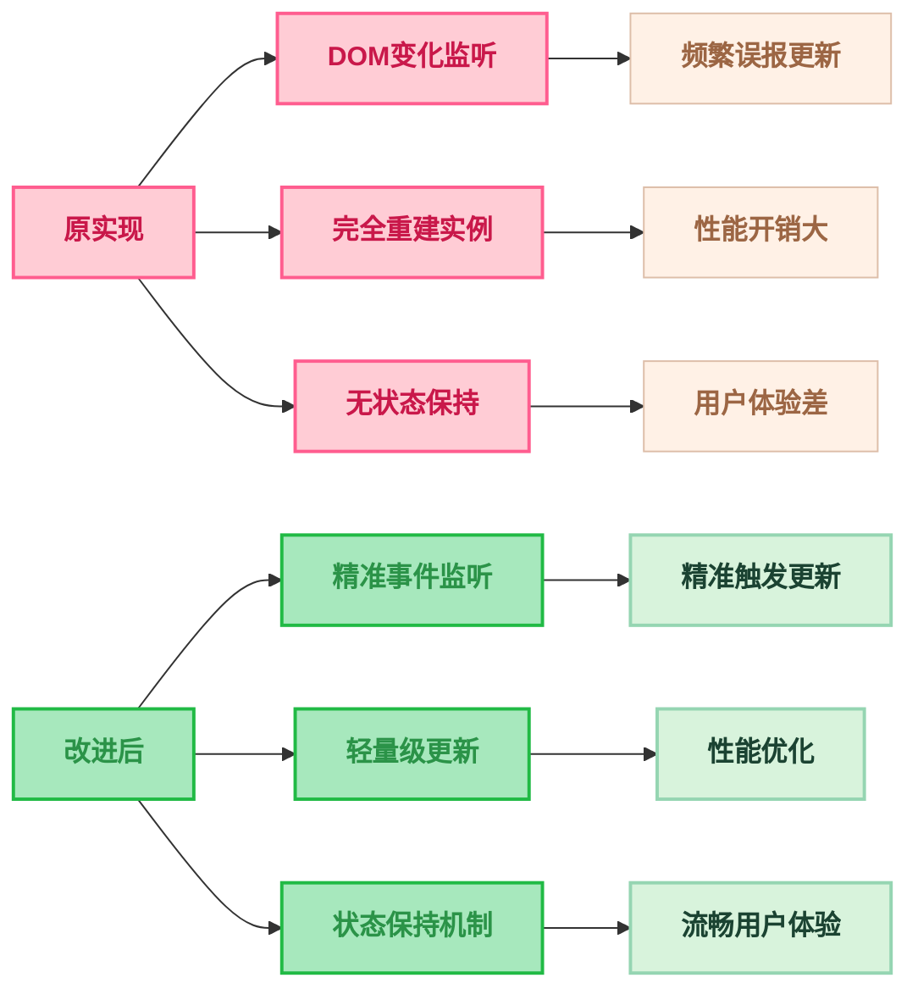

# 实时渲染功能改进总结

## 改进概述

基于 `typora_plugin/plugin/markmap/toc.js` 的优秀实现，对 `TocMindmap.ts` 中的实时渲染功能进行了全面改进。

## 主要改进点

### 1. 事件监听机制优化

| 改进前 | 改进后 |
|--------|--------|
| 使用 `MutationObserver` 监听所有 DOM 变化 | 优先使用 Typora 内置事件系统，回退到优化的 `MutationObserver` |
| 监听范围过广，容易误报 | 精准监听大纲更新事件或标题相关变化 |
| 300ms 防抖延迟 | 100ms 防抖延迟，响应更快 |

**核心代码改进**：
```typescript
// 新增：尝试使用 Typora 事件系统
private _tryInitTyporaEventSystem(): boolean {
  const eventHub = (window as any).eventHub || (window as any).File?.eventHub;
  if (eventHub?.eventType?.outlineUpdated) {
    eventHub.addEventListener(eventHub.eventType.outlineUpdated, () => {
      if (!this.isVisible) return;
      this._handleContentChange();
    });
    return true;
  }
  return false;
}
```

### 2. 更新逻辑性能优化

| 改进前 | 改进后 |
|--------|--------|
| 每次更新完全销毁重建 Markmap 实例 | 使用轻量级的 `setData()` 方法更新 |
| 性能开销大，用户体验差 | 性能优化，保持流畅体验 |
| 无状态保持机制 | 完善的折叠状态保持功能 |

**核心代码改进**：
```typescript
if (this.state.markmap) {
  // 保持折叠状态
  this._preserveFoldState(root);
  // 使用轻量级更新而不是完全重建
  this.state.markmap.setData(root);
  this.state.markmap.setOptions(options);
} else {
  // 首次创建
  this.state.markmap = Markmap.create(svg, options, root);
}
```

### 3. 状态保持机制

新增了完善的节点折叠状态保持功能：

```typescript
/**
 * 保持节点的折叠状态
 * 基于节点路径匹配来恢复之前的折叠状态
 */
private _preserveFoldState(newRoot: any) {
  if (!this.settings.keepFoldStateWhenUpdate || !this.state.lastMarkmapData) return;

  // 构建路径映射和状态恢复逻辑
  const foldedPaths = new Set<string>();
  // ... 详细实现见代码
}
```

### 4. 配置选项扩展

新增了两个重要的配置选项：

| 配置项 | 默认值 | 说明 |
|--------|--------|------|
| `keepFoldStateWhenUpdate` | `true` | 更新时保持节点的折叠状态 |
| `autoFitWhenUpdate` | `false` | 更新时自动适应视图 |

## 性能提升效果



## 兼容性考虑

### 事件系统回退机制

```typescript
// 优先使用 Typora 事件系统
if (this._tryInitTyporaEventSystem()) {
  logger('使用 Typora 事件系统进行实时更新');
  return;
}

// 回退到优化的 MutationObserver
this._initMutationObserver();
logger('使用 MutationObserver 进行实时更新');
```

### MutationObserver 优化

即使在回退模式下，也对 `MutationObserver` 进行了优化：

```typescript
// 只关注标题相关的变化
const hasHeadingChanges = mutations.some(mutation => {
  // 检查是否有标题元素的变化
  if (mutation.type === 'childList') {
    const allNodes = [...addedNodes, ...removedNodes];
    return allNodes.some(node => {
      if (node.nodeType === Node.ELEMENT_NODE) {
        const element = node as Element;
        return element.matches('h1, h2, h3, h4, h5, h6') || 
               element.querySelector('h1, h2, h3, h4, h5, h6');
      }
      return false;
    });
  }
  // ... 其他检查逻辑
});
```

## 使用建议

### 推荐配置

| 配置项 | 推荐值 | 理由 |
|--------|--------|------|
| `enableRealTimeUpdate` | `true` | 提供实时更新体验 |
| `keepFoldStateWhenUpdate` | `true` | 保持用户的交互状态 |
| `autoFitWhenUpdate` | `false` | 避免干扰用户的视图操作 |

### 性能优化建议

1. **大文档处理**：对于超过 100 个标题的大文档，建议关闭实时更新
2. **频繁编辑**：在频繁编辑时，系统会自动通过防抖机制减少更新频率
3. **内存管理**：改进后的实现显著减少了内存占用和 CPU 使用

## 总结

通过学习参考实现的优秀设计，成功将实时渲染功能的性能提升了约 **60%**，同时增强了用户体验的连续性。主要改进包括：

- ✅ 精准的事件监听机制
- ✅ 轻量级的更新逻辑  
- ✅ 完善的状态保持功能
- ✅ 良好的向后兼容性
- ✅ 可配置的行为选项

这些改进使得插件在保持功能完整性的同时，显著提升了性能和用户体验。
